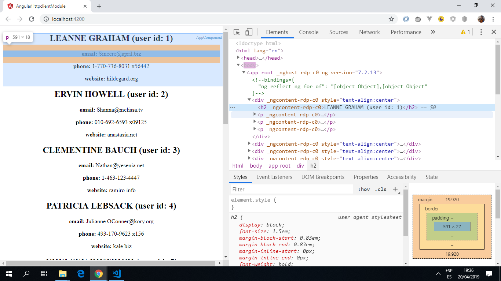

# :zap: Angular API User Posts

* App to get user data from an external [JSONPlaceholder](https://jsonplaceholder.typicode.com) API.
* **Note:** to open web links in a new window use: _ctrl+click on link_


## :page_facing_up: Table of contents

* [:zap: Angular API User Posts](#zap-angular-api-user-posts)
  * [:page_facing_up: Table of contents](#page_facing_up-table-of-contents)
  * [:books: General info](#books-general-info)
  * [:camera: Screenshots](#camera-screenshots)
  * [:signal_strength: Technologies](#signal_strength-technologies)
  * [:floppy_disk: Setup](#floppy_disk-setup)
  * [:computer: Code Examples](#computer-code-examples)
  * [:cool: Features](#cool-features)
  * [:clipboard: Status & To-Do List](#clipboard-status--to-do-list)
  * [:clap: Inspiration](#clap-inspiration)
  * [:file_folder: License](#file_folder-license)
  * [:envelope: Contact](#envelope-contact)

## :books: General info

* Angular httpClient used to get API data.

## :camera: Screenshots

.

## :signal_strength: Technologies

* [Angular v12](https://angular.io/)
* [RxJS Library v6](https://angular.io/guide/rx-library) used to [subscribe](http://reactivex.io/documentation/operators/subscribe.html) to the API data [observable](http://reactivex.io/documentation/observable.html).

## :floppy_disk: Setup

* Run `ng serve` for a dev server. Navigate to `http://localhost:4200/`. The app will automatically reload if you change any of the source files.

## :computer: Code Examples

* `data.service.ts` using httpClient service with a `getUser()` function to get user details from the API.

```typescript
import { Injectable } from '@angular/core';
import { HttpClient } from '@angular/common/http';
import { User } from './user.model';

@Injectable({
  providedIn: 'root'
})
export class DataService {
  apiUrl = 'https://jsonplaceholder.typicode.com/users';

  constructor(private _http: HttpClient) { }

  //get array of users from API url
  getUsers() {
    return this._http.get<User[]>(this.apiUrl);
  }
}
```

## :cool: Features

* Angular httpClient used to get data from an external API.
* simple angular pipe used: `{{ user.name | uppercase }}` to convert username to uppercase.

## :clipboard: Status & To-Do List

* Status: Working. Updated may 2021.
* To-Do: nothing

## :clap: Inspiration

* [Original tutorial: How to use Angular 7 HttpClientModule with REST API](https://www.youtube.com/watch?v=yAT2HHusDDk)
* [Article on HttpClient: Angular Http — Angular 6 HttpClient Tutorial](https://www.techiediaries.com/angular-http-client/)

## :file_folder: License

* This project is licensed under the terms of the MIT license.

## :envelope: Contact

* Repo created by [ABateman](https://github.com/AndrewJBateman), email: gomezbateman@yahoo.com
